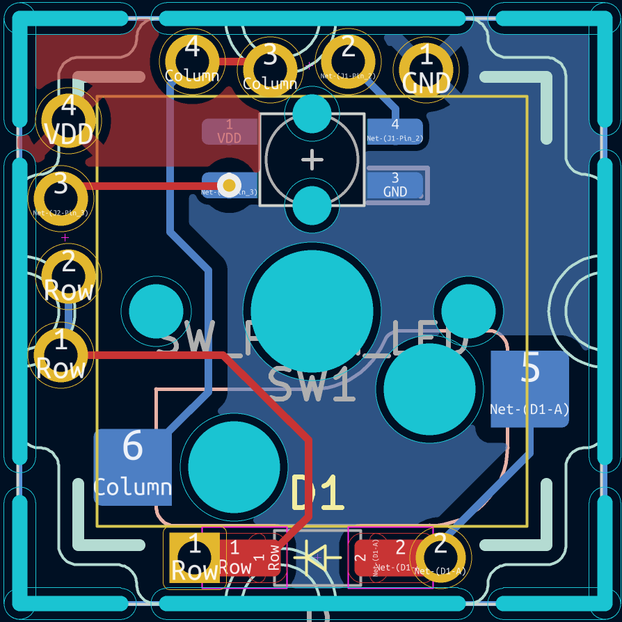

# Amoeba executive
## **This is a work in progress and should not go into production!**

Ameoba Single key PCB variant designed for simplicity.

The amoeba pcb family is often used in ergonamic split keyboards. 
Most amoeba variants are overly complex. This variant leverages the parallel relationship of rows, columns, and the VCC & GND nets to simplify the layout. 

Designed for staggered pin soldering and jumper wire connections for super easy builds.

@todo
* Pick a lane - multi-up snip-apart for 100x100 pre wired pcb, or single key outline for jlcpcb multi-up. (Second one  seems best) ("Member of the board" joke may not work - maybe change the name?)
* Add simple explanation of 1-many, net, and serial LED on front side
* Pin markings on backside
* Should via go through the pad?
* Migrate footprint and symbol libraries
* add credit for sofle symbols.

