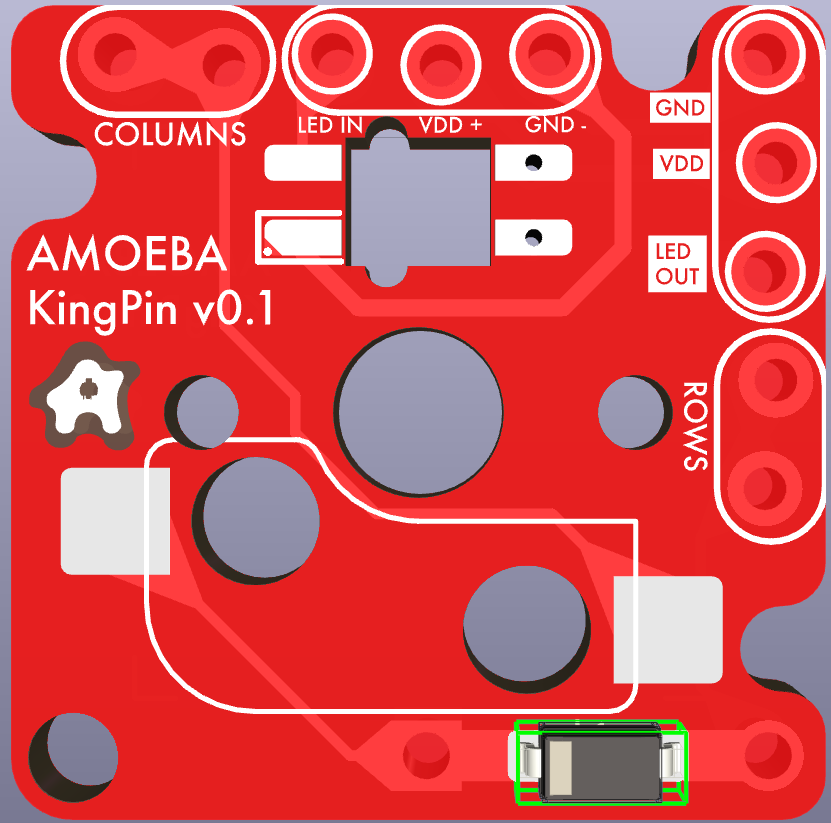
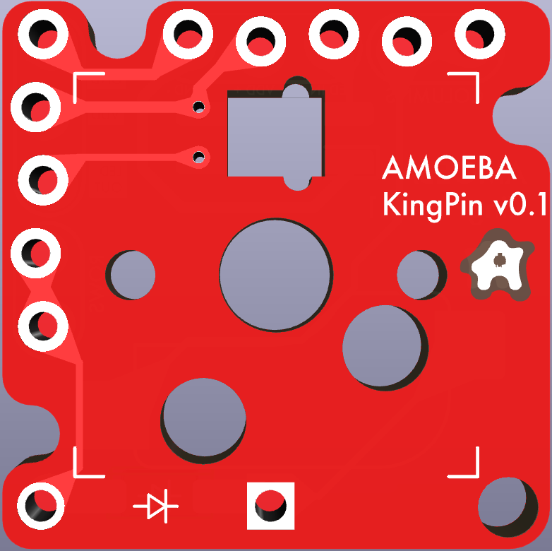

# Amoeba KingPin (formerly Ameoba Executive)
## **This is a work in progress and should not go into production!**

Ameoba Single key PCB variant designed for simplicity and easy building.

The amoeba pcb family is often used in ergonomic split keyboards. 
Most amoeba variants are overly complex and difficult to solder. 
This variant leverages the parallel relationship of rows, columns, and the VCC & GND nets to simplify the layout. Adds support for SMD or through-hole diodes.

Designed for staggered pin soldering and jumper wire connections for super easy builds.
All the pin holes are spaced at 2.54mm, so a breadboard can be used as an assembly jig.

@todo
* ~~Pick a lane - multi-up snip-apart for 100x100 pre wired pcb, or single key outline for jlcpcb multi-up. (Second one  seems best) ("Member of the board" joke may not work - maybe change the name?)~~
* Add simple explanation of 1-many, net, and serial LED on front side
* Pin markings on backside
* Should via go through the pad?
* ~~Migrate footprint and symbol libraries~~
* add credit for sofle symbols.
* ~~Add 2.2 mm screw holes on corners?~~
* Add pin crown logo
* Validate the markings are legible at scale.
* Maybe remove text and replace with symbols? (-/+ IN/OUT)
* Change topside pad shapes to mirror earlier variants with arrows.
* jlcpcb charges extra for 5x5 layout - can this layout be embedded in the repo?
* Add .step 3d part files to kicad mockup.
* Validate the new name "KingPin" is acceptable, and change the name across the repo.

